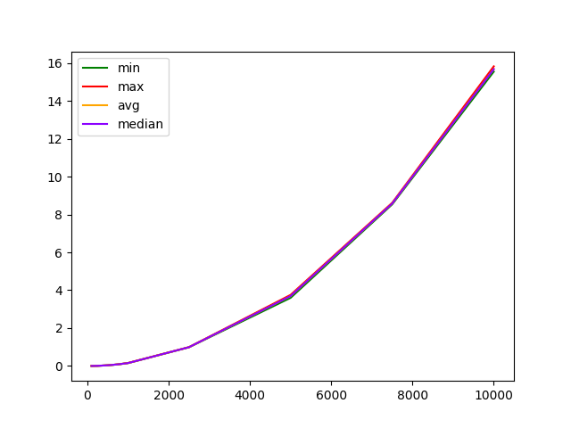

# Fucking Dijkstra's algorithm

This algorithm searches for the shortest path from the start node to all vertices 

### Installation
You need at least `Python 3.8` and `pip` installed to run this CLI tool.
1. Install it using `pip`
    ```shell
    pip3 install 
    ```
2. Call `--help` to ensure that it is successfully installed
    ```shell
    fucking-dijkstra  --help
    ```
3. In the .env files, create the constants `TESTING_DATA` (the directory for the generated test data) and `MEASUREMENTS` (the directory for the measured data). 

### Available commands

1. `dijkstra-algorithm`
finding the shortest path with Dijkstra's algorithm.
Takes the number of vertices, the start node and the matrix.
2. `generate-data`
generates an input matrix and a random start node. Accepts optionally `--start`, `--end`, `--step`, and `--count` of files to create.
3. `measure-algo`
measures the execution time of an algorithm and outputs them to a csv file.
4. `creat-chart` 
renders data from csv file. Take path to csv file

### Optional parameters
`--realize` for `dijkstra-algorithm` and `measure-algo`. Has implementations: naive (by default) and through sets.

### For more precise information enter 

```
fucking-dijkstra command-name --help
```

## Asymptotic computational complexity

### Naive implementation 


### Set implementation
