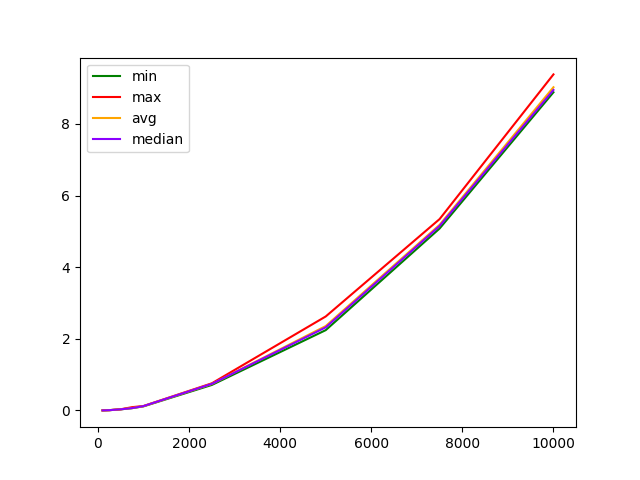

# Fucking Dijkstra's algorithm

This algorithm searches for the shortest path from the start node to all vertices.
He will help if you need to determine the shortest road, the price of a trip with transfers 

### Examples of using the algorithm in everyday life 
There are a number of flights between cities in the world, for each the cost is known. The cost of a flight from A to B may not be equal to the cost of a flight from B to A. Find the minimum cost route (possibly with transfers) from Almetyevsk to Sim? 

### Naive implementation 
Pros:
- simple implementation

Minuses:
- does not work with negative values
- asymptotic complexity O (n ^ 2) 

### Implementation through sets
Pros:
- automatically follows the shortest path of all possible
- uses only potentially useful paths
- no need to redefine ```vertex``` 
- asymptotic complexity O (n * log(n))


### Installation
You need at least `Python 3.8` and `pip` installed to run this CLI tool.
1. Install it using `pip`
    ```shell
    pip install dijkstra-algorithm 
    ```
2. Call `--help` to ensure that it is successfully installed
    ```shell
    fucking-dijkstra  --help
    ```
3. In the .env files, create the constants `TESTING_DATA` (the directory for the generated test data) and `MEASUREMENTS` (the directory for the measured data). 

### Available commands

1. `dijkstra-algorithm`
finding the shortest path with Dijkstra's algorithm.
Takes the number of vertices, the start node and the matrix.
2. `generate-data`
generates an input matrix and a random start node. Accepts optionally `--start`, `--end`, `--step`, and `--count` of files to create.
3. `measure-algo`
measures the execution time of an algorithm and outputs them to a csv file.
4. `creat-chart` 
renders data from csv file. Take path to csv file

### Optional parameters
`--realiz` for `dijkstra-algorithm` and `measure-algo`. Has implementations: naive (by default) and through sets.

### For more precise information enter 

```
fucking-dijkstra command-name --help
```

## Asymptotic computational complexity

Looking at the resulting graphs, we note that they coincide with the assumed asymptotic complexity in time, from which we can conclude that our utility is working successfully. 

### Naive implementation 


### Set implementation



[Video tutorial in Russian](https://www.youtube.com/watch?v=IhhajO5wVOA)